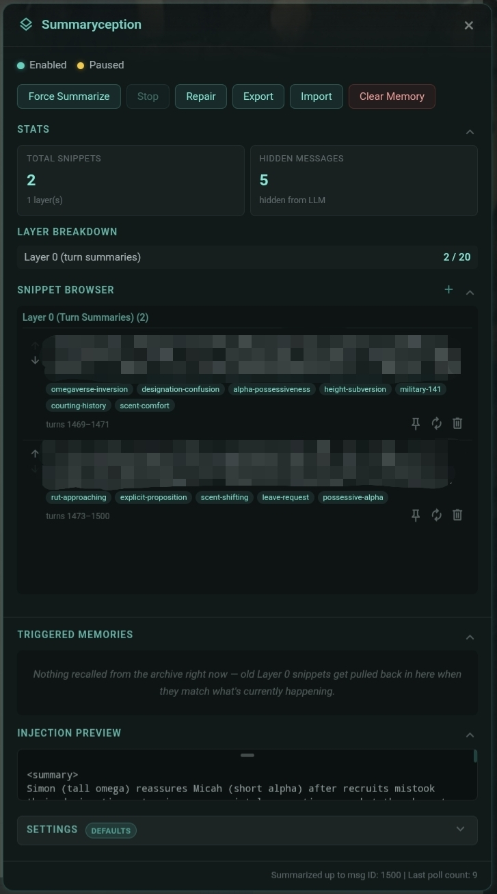
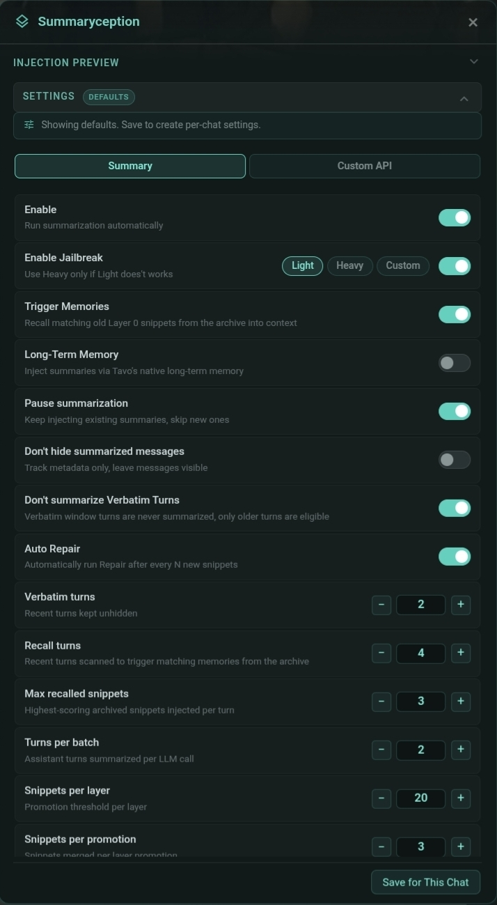
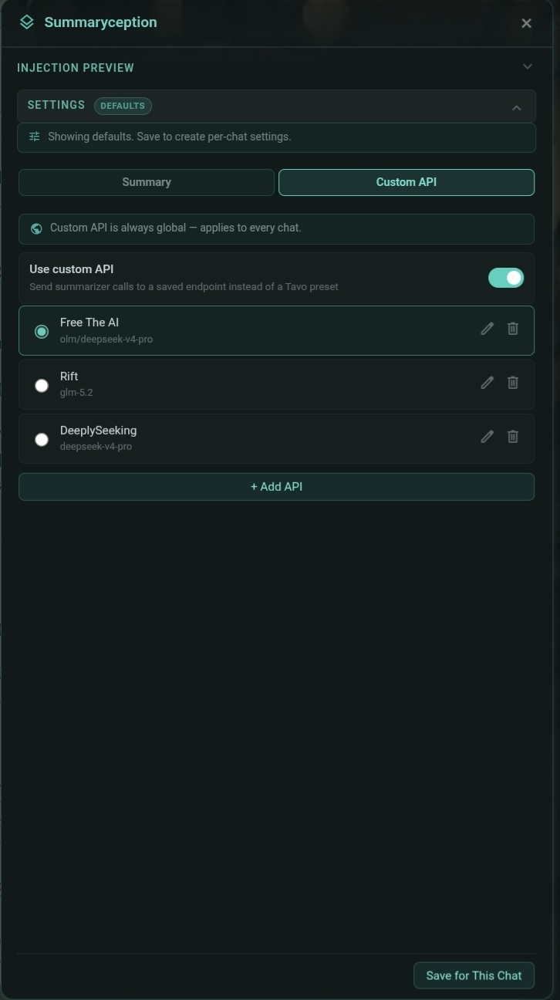
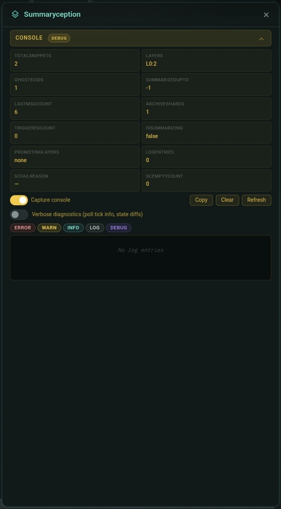

Fork made for Tavo.
- Better, mobile focused UI
- Improved **Repair** functionality
- Adds **Retrigged Memories**
- Adds **Snippet Creation**
- Adds **Snippet Pin**
- Adds **Snippets kept after promotion**
- Adds **Per chat settings**
- Adds **Multilingual support** (UI and Output)
- Adds **Console - Debug** menu
- Uses ID for promotion/summary
- Overall prompt improvements
---

__**SETTINGS:**__ Explanation and recommended values

**Enable: `ON`**
> Enable auto Summary

**Enable Jailbreak: `ON - Light`**

**Trigger Memories: `ON`**

**Long-Term Memory: `OFF`**

**Pause summaryzation: `OFF`**

**Don't hide summarized messages: `OFF`**

**Don't summarize Verbatim Turns: `ON`**

**Auto Repair: `ON/OFF`**

**Verbatim turns: `02 to 06`**
> The **vt** last Assistant and User messages won't be hidden (total ≈ vt×2)

**Recall turns: `02 to 06`**
> turns scaned to matchmaking tags

**Max recalled snippets: `02 to 05`**
> snippets that will be re-injected, uses a pontuation system (more tags match = higher pontuation)

**Turns per batch: `01 to 05`**
> **tb** messages will be summarized per snippet (total = tb×2): smaller number = more detailed

**Snippets per layer: `20 to 30`**
> **sl** snippets per leyer

**Snippets per promotion: `02 to 06`**
> **sl** number turns **sp** number when layers gets filled

**Snippets kept after promotion: `02 to 06`**
> Newest **Snippets** left behind in the previous **Layer**

**Max layers: `5 to 10`**
> **ml** maximum layers (about ml×sl snippets)

**Auto Repair interval: `3 to 5`**
> Snippet count before Auto Repair runs.

**Prompt Style: `Any`**

---
__**IMPORTANT,** *if using **Long-Term Memory ON:***__
> Deactivate auto Long-Term Memory updates
> ```
> More > Long-term memory > Auto summarize > set to 0
> ```

__**IMPORTANT,** *if using **Long-Term Memory OFF:***__
> Create a **Preset Entry** on your choosen Preset following these instructions: 
> ```
> Role: System
> Injection position: In-chat
> Injection depth: 1
> Content: important_story-events = {{getvar::sc_summary.assembled}}
> ```
> OR use the provided Lorebook **[SC - Summaryception.json](https://discord.com/channels/1356606095207960616/1526103139575402516/1540150387645091931)**

__**DO NOT:**__
> Use **Lorebook**, **Preset entry** and **Long-term Memory: ON** at the same time!
> This will cause DUPLICATE INFORMATION. 
> Choose ONE.
---

